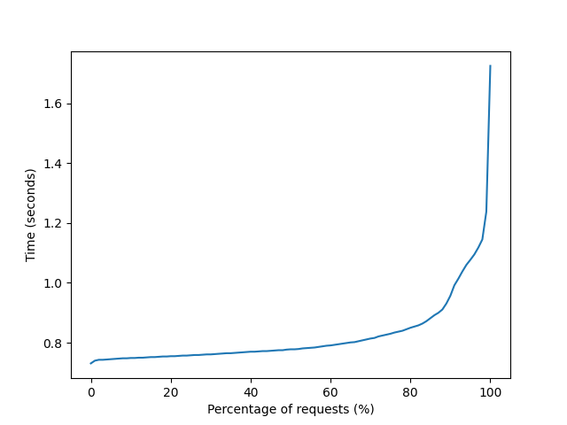

# concurrency-assignment-2

This assignment is a distributed system for a research account and grant management system.

# Installing

Python 3 is required to run the program (Python 3.6 or higher).
Other dependencies for the project are stored in `requirements.txt` and can be installed with the command:

`pip3 install -r requirements.txt`

Note that the command on your system may be different if `pip` is installed in a different way.

# Running the program

1. Run the registry on port 9000 with the following command:
`python3 service_registry.py`

2. Run the agency server on port 9001 with the following command:
`python3 agency.py 9001`

3. Run the college server on port 9002 with the following command:
`python3 dcu.py 9002`

4. Run the researcher threads which simulate multiple clients and make grant requests and access the accounts:
`python3 researchers.py`

# Program description

## Registry

The Service Registry is a service that provides a central access location for all of the services in the system. It allows services to 
register themselves, and provides a mechanism to query the registry for other services. The registry is a simple HTTP server that listens on 
port 9000. The registry is a singleton, so there is only one instance of the registry running at any given time. The registry is a RESTful 
service, so it uses the [RESTful API](https://en.wikipedia.org/wiki/Representational_state_transfer). The registry is a simple key-value 
store, where the key is the type of the service, and the value is an object that stores information about the service. 

Services can register with the registry by sending a POST request to the registry's `register` endpoint and they unregister by sending a 
POST request to the `unregister` endpoint.

The service registry improves the availability of the system by making it possible to run multiple instances of each service. If one service 
instance fails, the other instances will still be able to handle requests. Load is evenly distributed among the services by randomly 
choosing a service instance when one is requested.

# Services

The other services include `agency.py` and `dcu.py` and they are registered in the registry before use.

To improve availability, you may run multiple instances of each service which each instance running on a different port.

## Agency

The agency is responsible for processing and either accepting or rejecting grant proposals. The agency will immediately notify a researcher 
if a proposal is rejected and this occurs if the requested amount not between 300,000 - 500,000. If a proposal is accepted, the agency sends 
the proposal details to the DCU server which then creates an account for the proposal.

As many agency servers as required can be run. At least one agency server is required.

## College

For now, one college server is supported, that is, DCU.

The college server in `dcu.py` is receives requests from `agency.py` containing information about accepted proposals. This server creates 
new accounts for the proposal by creating a new JSON file for it in the `account_files` directory. Authorized researchers can later read or 
write to these account files via HTTP requests to the DCU service.

# Researchers

We simulate activity in our system by creating multiple projects. In each project, a professor thread sets up the project by submitting the 
proposal. If the proposal is rejected, the professor thread terminates. Otherwise, the professor thread adds his or her students to the 
project and starts new threads for each student. The student and professor threads then carry out research activities which include 
accessing account details and withdrawing money from their research account.

When an account is created, it begins with an initial balance and the number of days which it is valid for. This value is decreased once per 
second and if it reaches zero, the account goes out of date and all professor and student threads related to that account terminate. 
Withdrawing all funds from a research account will also cause all research threads to terminate.

# Failure handling

If services are not available, or if they are not able to respond to requests, then the system will fail. However, the probability of such a 
state occuring in the real world can be reduced by running multiple services of the same type. The registry will be able to deregister 
services that crash.

## Concurrency

A global lock variable named `global_lock` in `researchers.py` ensures that each research operation is atomic: a researcher cannot be 
interrupted during an action until the action is finished. The lock ensures that the console output does not become mixed up by several 
threads.

## Benchmark

The benchmark directory contains code for measuring the performance of the system. The system performance is measured using Apache Benchmark and matplotlib. 

The graph can be generated using the following command:

`sh apache-benchmark.sh && python3 plot.py`

The graph shows that the performance of the API tends to 
degrade over time as more and more requests are made. 
The problem could be prevented by running the server on a more 
powerful machine or running multiple instances of the server.

# Personal reflections

## Gytis

I contributed the service registry and the documentation. The course material helped by discussing various tradeoffs in the design of distributed systems.

The service registry improved the characteristics of the system, by allowing failures to be handled gracefully. However, a better 
implementation would be to have the registry automatically detect when services are down, and then automatically deregister them. If a 
service goes down without deregistering, then the registry would not know that the service is down, and would continue to allow other 
services to attempt to contact it.

## Stephen

I was responsible for implementing the program for simulating the researcher clients in `researchers.py` and the initial versions of the 
servers in `dcu.py` and `agency.py`.

This assignment taught me more about how to create concurrent programs and reliable distributed systems using Python. 

I found the course content on concurrent and multithreaded programming and distributed systems useful during the assignment.

To improve the implementation next time, I might make the behavior of the researcher threads more unpredictable and random so that the program is more realistic.

# Video demo

Demo link: https://drive.google.com/file/d/17xNEXkyKF2EfRFvpAzKviZ4BNLyWY-vM/view?usp=sharing
